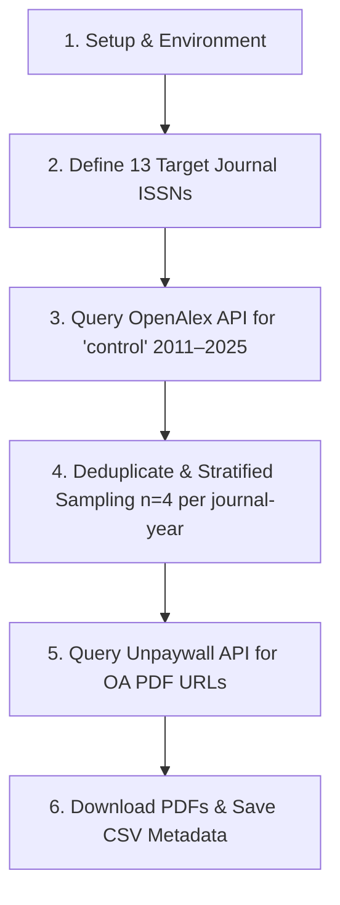

# Sampling and PDF Acquisition Workflow for Plant Disease Control Literature (2011–2025)

This repository (`paper-review-control-variables-stats`) contains the R script and output dataset for sampling quantitative plant disease control studies published between **2011 and 2025** across 13 leading plant pathology journals.

The primary objective is to enable reproducible bibliometric search, stratified sampling, and automated Open Access PDF retrieval using the [OpenAlex API](https://openalex.org/) and the [Unpaywall API](https://unpaywall.org/).

---

## 📁 Repository Structure

```text
paper-review-control-variables-stats/
├── .gitignore                              # Ignores local pdfs/ directory and .DS_Store
├── code.R                                  # Main reproducible R pipeline script
├── README.md                               # Repository documentation & reproducibility guide
└── sampled_articles_with_pdf_links.csv     # Final metadata CSV output (2011–2025 dataset)
```

*Note: Running `code.R` will automatically create a local `pdfs/` directory to store downloaded PDF files.*

---

## 🛠️ Prerequisites & Installation

### R Requirements

This script requires R version 4.0+ and the following packages:

```R
install.packages(c("httr2", "tidyverse", "fs", "janitor"))
```

### Core R Libraries
* **`tidyverse`**: Data manipulation (`dplyr`, `tidyr`, `purrr`, `readr`, `stringr`).
* **`httr2`**: Robust HTTP client for API interactions with automatic retries and rate limiting.
* **`fs`**: File system path management.
* **`janitor`**: Tabulation and data cleaning tools.

---

## 🔑 API Configuration

The workflow interacts with two public web APIs:

1. **OpenAlex API**: Used to search for published articles matching target ISSNs, search terms (`"control"`), and date ranges (`2011-01-01` to `2025-12-31`).
2. **Unpaywall API**: Used to locate legal Open Access PDF URLs for DOIs.

### Environment Variable Setup (Recommended)

To run the script securely without hardcoding credentials, add the following lines to your `.Renviron` file (`usethis::edit_r_environ()`):

```ini
OPENALEX_API_KEY="your_openalex_api_key_here"
UNPAYWALL_EMAIL="your_email@domain.com"
```

*If environment variables are not set, `code.R` falls back to default operational credentials.*

---

## 🚀 Pipeline Workflow (`code.R`)

The `code.R` script executes six sequential steps:



### Key Workflow Details:

1. **Target Journal Selection**: Includes 13 key plant pathology journals (e.g., *Phytopathology*, *Plant Pathology*, *European Journal of Plant Pathology*, *Tropical Plant Pathology*, *Australasian Plant Pathology*, etc.).
2. **Search Criteria**: Articles tagged as `type:article` containing the search term `"control"` published between `2011-01-01` and `2025-12-31`.
3. **Stratified Sampling**: `set.seed(123)` is set prior to sampling up to 4 articles per `(journal_target, year)` stratum.
4. **PDF Resolution**: Queries Unpaywall's `/v2` REST endpoint for each DOI to discover open-access PDF locations.
5. **PDF Downloading**: Standardizes file naming (`<YEAR>_<JOURNAL>_<TITLE_TRUNCATED>.pdf`) and saves downloaded PDFs locally into `pdfs/`.

---

## 📊 Dataset Schema (`sampled_articles_with_pdf_links.csv`)

The output CSV file contains the following fields:

| Column Name | Data Type | Description |
| :--- | :--- | :--- |
| `journal_target` | Character | Target journal name as defined in grid. |
| `year` | Integer | Publication year (2011–2025). |
| `issn_used` | Character | Online ISSN identifier used for the query. |
| `issn_type` | Character | Type of ISSN (`issn_online`). |
| `search_term` | Character | Search term (`control`). |
| `title` | Character | Article title retrieved from OpenAlex. |
| `doi` | Character | Digital Object Identifier (DOI) link. |
| `cited_by_count` | Integer | Citation count recorded in OpenAlex. |
| `journal_openalex` | Character | Journal title formatted by OpenAlex. |
| `openalex_id` | Character | Unique OpenAlex work identifier URL. |
| `pdf_url` | Character | Direct Open Access PDF URL from Unpaywall (or `NA`). |
| `file_name` | Character | Standardized PDF filename. |
| `file_path` | Character | Relative path to local PDF file (`pdfs/<file_name>`). |
| `downloaded` | Logical | `TRUE` if PDF was successfully fetched and saved locally; `FALSE` otherwise. |

---

## 🔁 Reproducibility Instructions

To reproduce the complete query, sampling, PDF acquisition, and CSV generation:

1. Clone or download this repository (`paper-review-control-variables-stats`).
2. Open R / RStudio and set your working directory to the `paper-review-control-variables-stats/` folder.
3. Run `code.R`:

```R
source("code.R")
```

The script will automatically populate/update `sampled_articles_with_pdf_links.csv` and download available PDFs into `pdfs/`.

---

## 📄 License & Attribution

This reproducibility package is prepared for public hosting on GitHub. The article metadata is retrieved via OpenAlex (CC0) and Unpaywall. Downloaded PDF files belong to their respective copyright holders and publishers.
